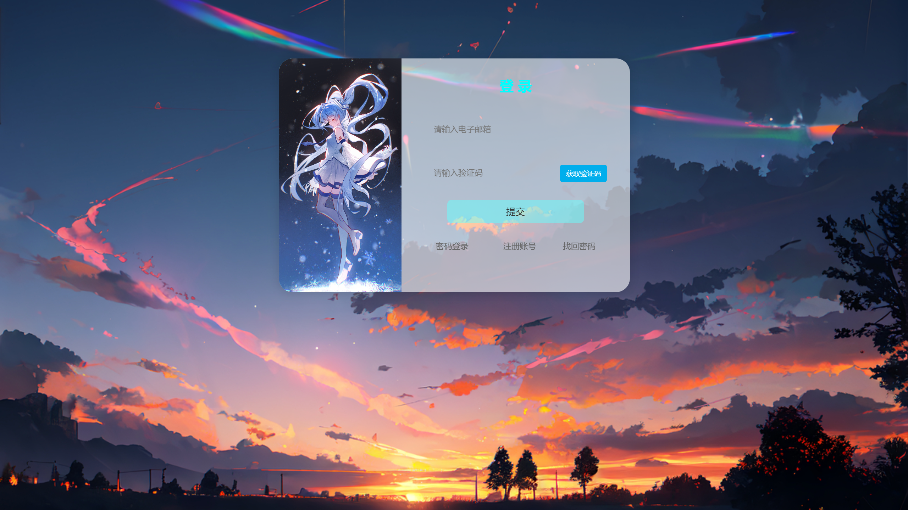
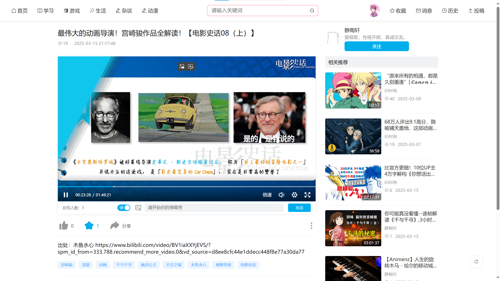
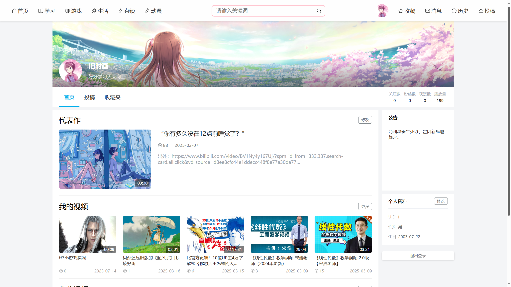
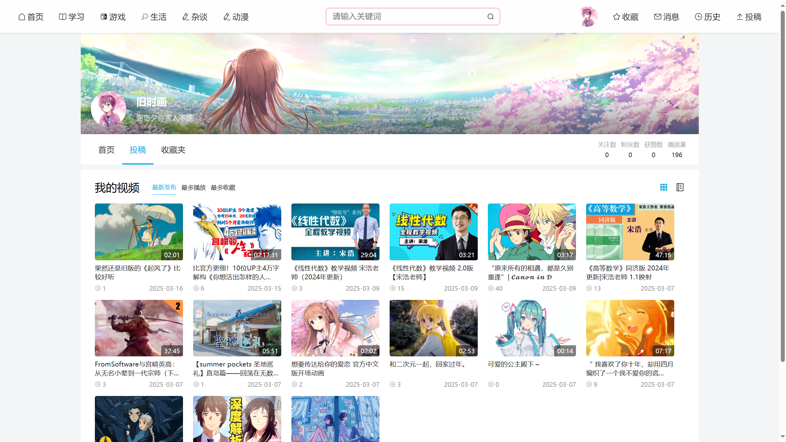
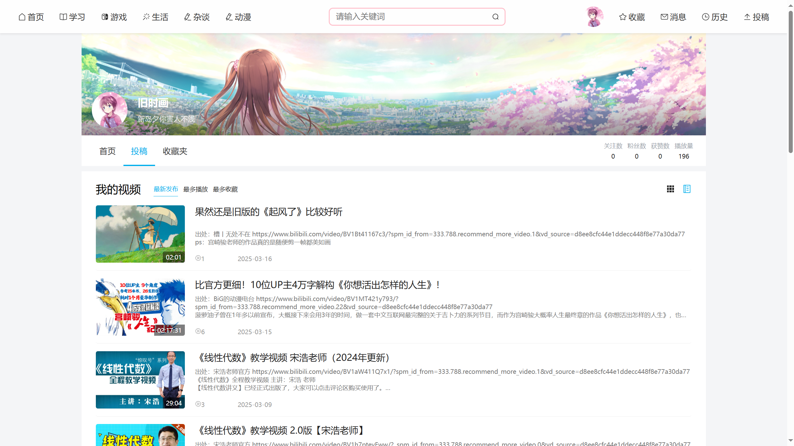
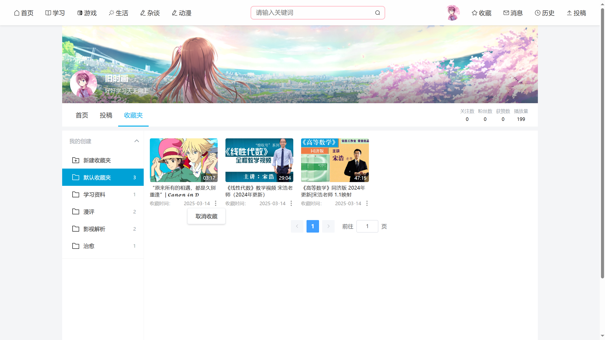
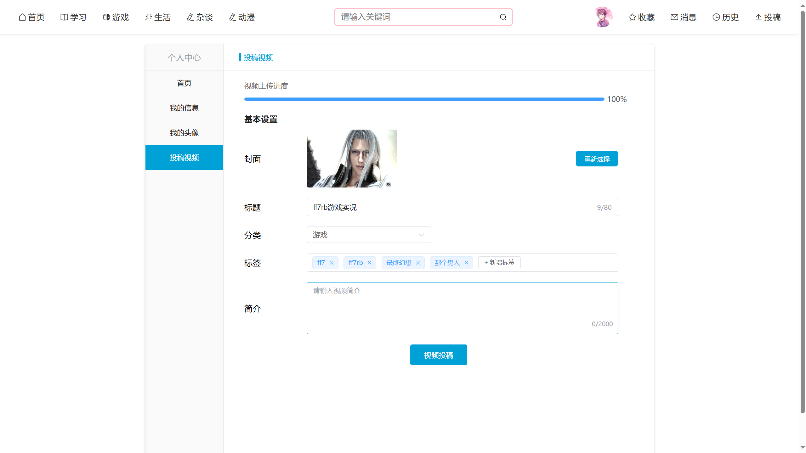

# 基于Vue+Springboot的视频网站的设计与实现 


## 项目预览

















## 介绍

`suyasuya`  是以学习web相关技术为目的而个人开发的前后端分离视频网站，整体界面的布局仿照Bilibili，目前主要业务功能还尚不完整。

- 前端使用vue3框架，结合ElementPlus、Vue-Router、Pinia、Vue-Cropper等相关技术栈进行开发，采用Axios进行接口请求。

- 后端采用Springboot框架，结合MybatisPlus、JWT等相关技术栈进行开发，使用redis作为缓存数据库。

- 使用MySQL作为网站数据库。


## 主要功能模块

1. **用户注册与登录**：目前该网站不支持游客登录，用户需注册和登录后才能访问该网站，使用电子邮箱作为主要的身份凭证。
2. **个人信息管理**：提供了个人相关信息的CRUD方法。
3. **视频浏览**：主页会随机推荐网站视频，也可进入相应的视频分类页浏览分类视频。
4. **视频搜索**：可在搜索框中输入关键词进行视频搜索，支持搜索的内容有：视频标题、视频标签、视频作者等。其中，视频标题支持模糊查询。系统会保留用户的搜索关键词，用户可通过搜索栏下方的搜索历史管理搜索关键词。
5. **视频播放**：用户可通过点击进入视频播放页，在播放页中，可通过系统设定的快捷键控制视频播放，目前设置的快捷键有：空格 => 视频播放或暂停播放，F => 全屏或取消全屏 D => 开启或关闭弹幕 ArrowLeft、ArrowRight => 视频播放进度控制（+-5s），ArrowUp、ArrowDown => 视频播放音量控制(+-10%)。
6. **视频投稿**：采用分步上传方式，即用户先上传视频，然后边等待视频上传完成边填写相关表单，表单信息校验通过且视频上传完成后即可投稿。
7. **历史记录**：系统会保存用户的视频观看记录，用户可以查看或删除历史记录。
8. **视频收藏**：系统会自动给用户分配默认收藏夹，该收藏夹只能修改相关信息，不能被删除。用户也可以自行创建视频收藏夹并进行相关的CRUD，在视频播放页可以进行视频收藏。
9. **个人空间**：用户可在个人空间页展示视频代表作，并填写个性签名、个人空间公告等信息。


## 特点

- 使用ffmpeg获取视频相关信息。
- 集成Spring Security安全框架，配合JWT实行token验证。
- 采用pinia状态管理仓库，配合pinia-plugin-persistedstate插件持久化用户的使用习惯，如视频播放音量、主页视频信息显示格式等。


## 项目结构

```
suyasuya
├─suyasuya-backend			后端项目代码
│  └─src
│      └─main
│         ├─java
│         │  └─com
│         │      └─example
│         │          └─demo
│         │              ├─common		公共类
│         │              ├─config		配置文件
│         │              ├─constants	常量类
│         │              ├─controller	controller层
│         │              ├─dto			dto层
│         │              ├─entity		实体类
│         │              ├─enums		枚举类
│         │              ├─filter		过滤器
│         │              ├─mapper		mapper层
│         │              ├─service		service层
│         │              │  └─impl		service实现类
│         │              ├─utils		工具类		
│         │              └─vo			vo层
│         └─resources	静态资源
│             ├─static
│             └─templates
|
└─suyasuya-frontend			前端项目代码
    └─src
        ├─api					接口封装
        ├─assets				静态资源
        │  ├─css				css样式
        │  └─imgs				图片
        ├─components			封装组件
        ├─router				路由文件
        ├─stores				状态管理仓库
        ├─utils					工具类
        └─views					视图文件

```


## 构建和运行

### 外部依赖

- 后端依赖

  ​	mysql：v5.7

  ​	redis：v5.0

  ​	ffmpeg：ffmpeg-2025-02-17-git-b92577405b-full_build

- 前端依赖

​		node：v22.14.0

### 运行

后端项目：

1. 需修改 application-dev.yml 文件，修改数据库配置、邮箱配置、文件上传路径、ffmpeg项目路径等相关信息
2. 进入 suyasuya-backend 文件夹，运行命令  `mvn spring-boot:run`  启动项目（需安装maven）

前端项目：

1. 修改开发环境/生产环境配置的url路径
2. 进入 suyasuya-frontend 文件夹，运行命令  `npm run dev`  启动项目。若为第一次启动，需运行  `npm install`  命令安装项目依赖
